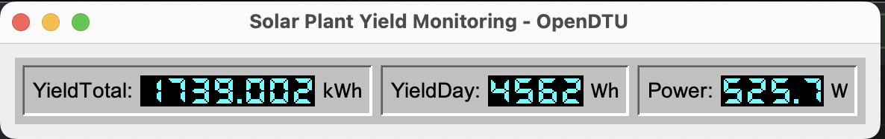
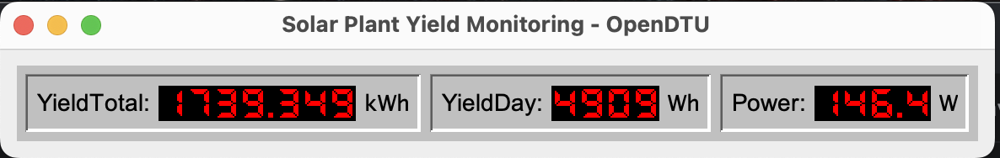
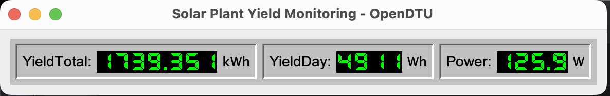

# SolarMonitoringApplet
This Applet will show actual yield data from a solar power plant connected to OpenDTU.

or

or

...

## Purpose
Retrieve actual yield data from OpenDTU server and display data in a little window.
Because I like the look of old 7-segment displays, the values are shown as 7-segment-digits. The digits shown above are in color CYAN, RED and GREEN. Following
colors are selectable:
RED, GREEN, BLUE, YELLOW, CYAN, WHITE

## Tested with following components
* Software:
    * OpenDTU Firmware-Version v26.3.30
* Hardware:
    * Hoymiles HM-800 Microinverter
    * AzDelivery ESP32 NodeMCU Module WLAN WiFi Development Board | Dev Kit C V2
    * AzDelivery NRF24L01 2,4 GHz Wireless Module 

## Java prerequisites
As of using records the used Java version may be at least Java 16 (records were implemented first as preview since JDK14).
Java 17 has been release half a year later as a LTS-version, so Java 17 should be used as minimum version.

## Usage
### Start program
>  java -jar SolarMonitoringApplet [--RED | --GREEN | --BLUE | --CYAN | --YELLOW | --WHITE] {url}"  
>   
>  e.g. java -jar SolarMonitoringApplet --CYAN 192.168.1.99

## Links
Git-Repository: <https://github.com/rthillmann/SolarMonitoringApplet>  
OpenDTU Web-Api documentation: <https://github.com/tbnobody/OpenDTU/blob/master/docs/Web-API.md>
